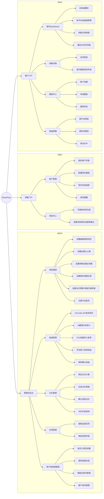
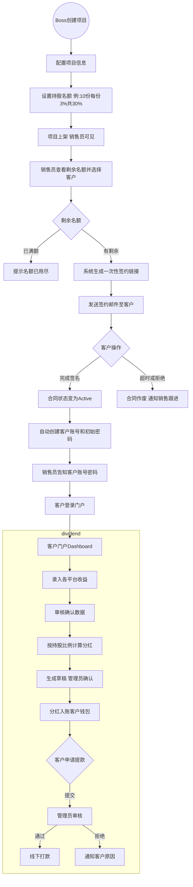
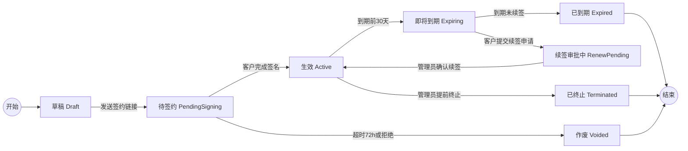
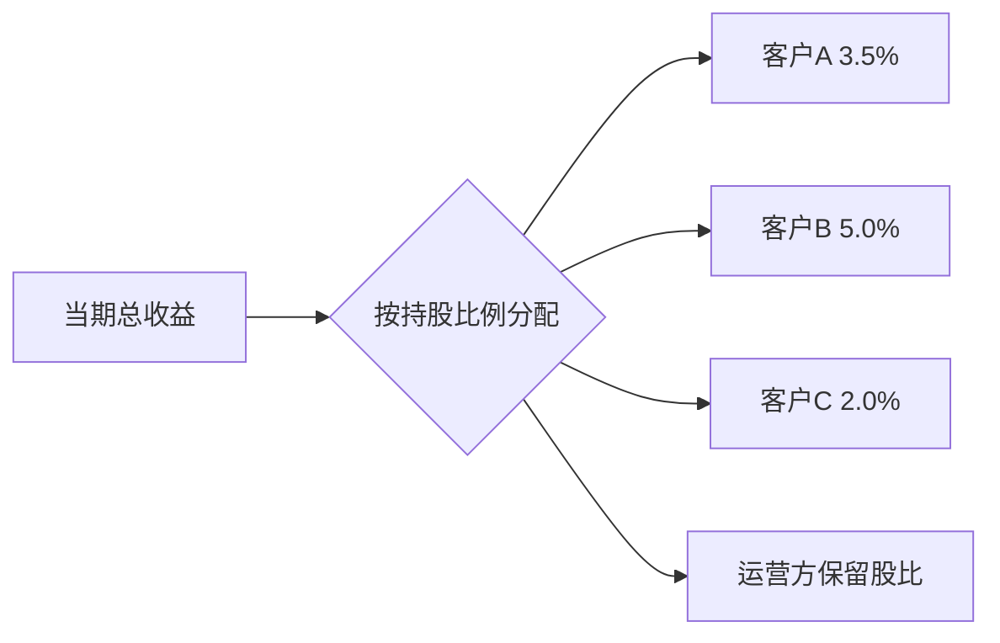
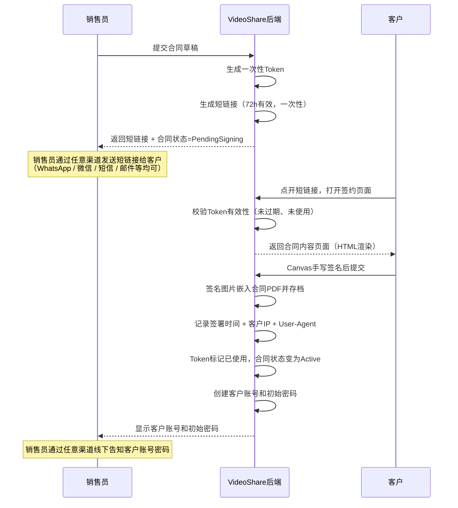
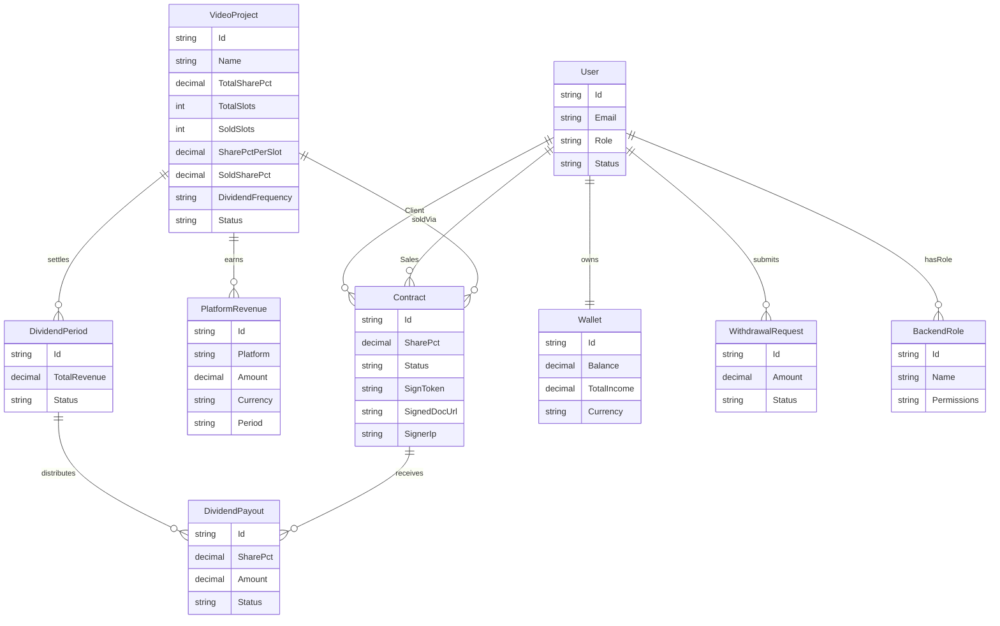
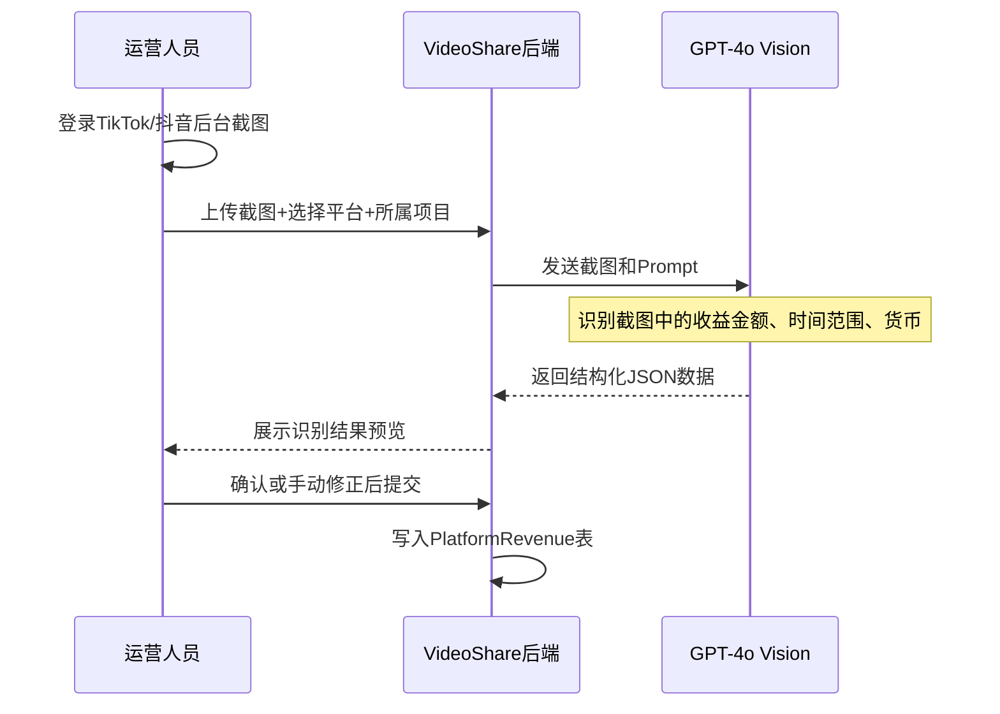
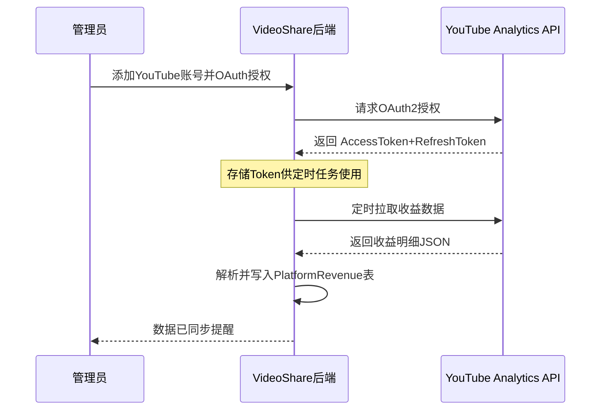

# ShareFlow — 短视频持股分红平台设计文档

> 项目名称：**ShareFlow**
> 版本：v1.0 | 日期：2026-04-26 | 状态：立项设计

---

## 一、项目背景与目标

### 背景

某公司（以下简称"运营方"）持有 **100+ 个 AI 短视频内容**（仙侠类等题材），分布在多个账号，同步上传至 TikTok、YouTube、抖音等平台，持续产生广告/流量收益。

运营方希望向外部**持股客户开放分红参与权**：客户签约获得项目持股比例，按比例参与后续分红收益。整个流程由公司**销售团队**负责对接和签约，客户完成电子签约后自动开通账号，通过**客户门户**查看收益、持股和申请提款。

> **双实例说明**：系统采用**同一套代码库，双实例部署**策略。国内实例（境内服务器）专注抖音/快手等国内平台、CNY结算；国外实例（境外服务器）专注 TikTok/YouTube/Instagram、USD结算。两个实例数据完全独立，通过环境变量 `REGION` 区分运行模式。

### 目标

- 内部管理端：管理项目、收益录入、分红发放，全流程可控
- 销售端：发起签约、管理客户关系，傻瓜式操作
- **管理端与销售端界面统一使用中文**（无论境外/境内实例）
- 客户端（境外实例）：**英文界面**，图表丰富，国际化体验，随时掌握分红收益
- 客户端（境内实例）：**中文界面**，对接国内提款方式

---

## 二、角色与权限设计

### 2.1 角色分类

| 类型                   | 角色                      | 评述                                           |
| ---------------------- | ------------------------- | ---------------------------------------------- |
| **后台内部角色** | 超级管理员 `SuperAdmin` | 唯一内置角色，拥有全部权限，可创建其他后台角色 |
| **后台内部角色** | 自定义角色（可多个）      | 匚老板创建，自由勾选菜单权限                   |
| **销售角色**     | `Sales`                 | 固定角色，负责客户签约流程                     |
| **客户角色**     | `Client`                | 固定角色，持股客户门户                         |

### 2.2 后台自定义角色示例

| 建议角色                  | 建议开放的菜单权限                               | 适合人员  |
| ------------------------- | ------------------------------------------------ | --------- |
| 老板 `Boss`             | 项目管理、分红确认、合同查阅、提款审批、数据报表 | 公司老板  |
| 运营 `Operator`         | 收益录入、AI截图、CSV导入、收益审核              | 运营/助理 |
| 财务 `Finance`          | 分红历史、提款审批、收益报表                     | 财务人员  |
| 销售管理 `SalesManager` | 销售员管理、全部合同查阅、客户列表               | 销售主管  |

> 老板只需关注重要决策，不接触收益录入等体力活。

### 2.3 权限菜单清单

| 菜单权限点    | 标识                   | 说明                               |
| ------------- | ---------------------- | ---------------------------------- |
| 项目创建/编辑 | `project.write`      | 创建项目、设置股比/周期            |
| 项目查看      | `project.read`       | 仅查看项目列表                     |
| 收益录入      | `revenue.write`      | AI识别、CSV导入、手动录入          |
| 收益审核      | `revenue.verify`     | 确认收益数据有效                   |
| 分红生成      | `dividend.write`     | 生成/确认分红草稿                  |
| 分红查看      | `dividend.read`      | 查看历史分红记录                   |
| 合同查看      | `contract.read`      | 查看全部合同                       |
| 续签审批      | `contract.renew`     | 审批客户续签申请                   |
| 提款审批      | `withdrawal.approve` | 审批/拒绝提款申请                  |
| 用户管理      | `user.manage`        | 创建/禁用内部账号                  |
| 角色管理      | `role.manage`        | 创建角色、分配权限（仅SuperAdmin） |
| 数据报表      | `report.read`        | 查看各类报表和导出                 |

---

## 三、功能全景



---

## 四、核心业务流程

### 4.1 端到端全流程



---

### 4.1.1 持股名额（Slots）机制说明

| 配置项       | 示例值       | 说明                                          |
| ------------ | ------------ | --------------------------------------------- |
| 可售总股比   | 30%          | 运营方愿意出让的股比上限                      |
| 总名额份数   | 10 份        | 最多签 10 个持股客户                          |
| 每份持股比例 | 3%           | 每位客户持有 3%（也可每份不同，由销售员填写） |
| 已售名额     | 系统自动计算 | 合同状态为 Active 的数量                      |
| 剩余名额     | 系统自动计算 | 总份数 − 已售份数，为 0 时销售不可新建合同   |

> **每份持股比例可以固定（简单模式）或由销售员自定义（灵活模式）**，两种模式在创建项目时选择。

---

### 4.2 合同生命周期



---

### 4.3 分红计算逻辑



公式：

$$
客户分红 = 总收益 \times \frac{客户持股比例}{100}
$$

---

### 4.4 电子签交互时序（自研）



---

## 五、数据模型

### 5.1 实体关系图



---

## 六、平台收益支持

### 收益录入四档方案

| 方案                   | 适用平台                                                    | 说明                                                        |
| ---------------------- | ----------------------------------------------------------- | ----------------------------------------------------------- |
| **API 自动同步** | YouTube                                                     | YouTube Analytics API，OAuth 授权后定时自动拉取广告收益数据 |
| **AI 截图识别**  | TikTok、Instagram、Kwai、小红书(海外版)、抖音、快手、小红书 | 上传后台截图，AI自动识别收益数据，人工确认后入库            |
| **CSV 批量导入** | 各平台                                                      | 下载平台账单文件上传，自动解析入库                          |
| **手动录入**     | 品牌赞助、其他                                              | 无平台账单的收益，配合凭证文件上传                          |

### 平台详情

#### 境外实例支持平台

| 平台           | 枚举            | 主要收益类型                   | 货币 | 录入方式                       |
| -------------- | --------------- | ------------------------------ | ---- | ------------------------------ |
| TikTok         | `TikTok`      | 创作者基金、直播打赏、品牌工坊 | USD  | **AI截图识别** / CSV导入 |
| YouTube        | `YouTube`     | 广告分成、会员、超级留言       | USD  | **API自动同步**          |
| Instagram      | `Instagram`   | Reels 奖励、品牌合作           | USD  | **AI截图识别** / CSV导入 |
| 快手(Kwai)     | `Kwai`        | 创作者激励、直播打赏           | USD  | **AI截图识别** / CSV导入 |
| 小红书(海外版) | `Xiaohongshu` | 品牌合作、内容激励             | USD  | **AI截图识别** / CSV导入 |
| 品牌赞助       | `BrandDeal`   | 赞助合作费                     | USD  | 手动录入                       |

#### 境内实例支持平台

| 平台     | 枚举            | 主要收益类型         | 货币 | 录入方式                       |
| -------- | --------------- | -------------------- | ---- | ------------------------------ |
| 抖音     | `Douyin`      | 创作者激励、带货佣金 | CNY  | **AI截图识别** / CSV导入 |
| 快手     | `Kuaishou`    | 创作者激励、直播打赏 | CNY  | **AI截图识别** / CSV导入 |
| 小红书   | `Xiaohongshu` | 品牌合作、笔记激励   | CNY  | **AI截图识别** / CSV导入 |
| 品牌赞助 | `BrandDeal`   | 赞助合作费           | CNY  | 手动录入                       |

> **无汇率换算**：境外实例统一 USD，境内实例统一 CNY，各实例内部货币单一，分红计算无需跨币种换算。

### AI 截图识别流程



**AI Prompt 示例：**

```
请从这张截图中提取收益数据，返回 JSON 格式：
{
  "platform": "平台名称",
  "amount": "收益金额数字",
  "currency": "货币符号",
  "period_start": "YYYY-MM-DD",
  "period_end": "YYYY-MM-DD"
}
```

### YouTube API 同步流程



---

## 七、客户门户 UI 布局（英文界面）

```
┌─────────────────────────────────────────────────────────────────┐
│  ◈ VideoShare          Dashboard          [🔔]  [EN▼]  [Avatar] │
├────────────┬────────────────────────────────────────────────────┤
│            │  ┌─────────────┐ ┌─────────────┐ ┌─────────────┐  │
│  Overview  │  │Total Earned │ │ This Month  │ │  My Share   │  │
│  Earnings  │  │  $24,500    │ │   $2,130    │ │    3.5%     │  │
│  Contract  │  │  ↑ +8.2%   │ │  ↑ +5.1%   │  │ VideoProj1  │  │
│  Withdraw  │  └─────────────┘ └─────────────┘ └─────────────┘  │
│  Settings  │                                                     │
│            │  ┌──────────────────────────┐ ┌──────────────────┐ │
│            │  │ Earnings Trend (12 mo.)  │ │ Platform Split   │ │
│            │  │ [折线图 TikTok/YT/抖音] │ │  [环形饼图]      │ │
│            │  └──────────────────────────┘ └──────────────────┘ │
│            │                                                     │
│            │  ┌────────────────────────────────────────────────┐ │
│            │  │ Dividend History              [Export PDF →]   │ │
│            │  │ ● Apr 2026  $2,130  ██████████████  Paid ✓    │ │
│            │  │ ● Mar 2026  $1,980  █████████████   Paid ✓    │ │
│            │  │ ● Feb 2026  $2,050  █████████████   Paid ✓    │ │
│            │  └────────────────────────────────────────────────┘ │
└────────────┴────────────────────────────────────────────────────┘
```

---

## 八、技术选型

### 后端

| 技术     | 选择                          | 说明                                  |
| -------- | ----------------------------- | ------------------------------------- |
| 框架     | .NET 8 + ASP.NET Core Web API | 成熟稳定                              |
| ORM      | EF Core 8 + PostgreSQL 16     | Code First                            |
| 缓存     | Redis 7                       | Token黑名单、Session                  |
| 依赖注入 | Autofac                       | 模块化注册                            |
| 定时任务 | Quartz.NET                    | 到期提醒、分红统计                    |
| 日志     | Serilog                       | 结构化日志                            |
| 验证     | FluentValidation              | 请求校验                              |
| 映射     | Mapster                       | DTO 映射                              |
| 架构     | Clean Architecture            | Api/Application/Domain/Infrastructure |

### 前端

| 技术     | 选择                   | 说明               |
| -------- | ---------------------- | ------------------ |
| 框架     | Vue 3.5 + TypeScript 5 | Composition API    |
| 构建     | Vite 6                 | 快速热更新         |
| UI       | Naive UI               | 国际化友好         |
| 状态     | Pinia                  |                    |
| 请求     | Axios                  |                    |
| 国际化   | vue-i18n               | zh-CN / en-US 双语 |
| 图表     | ECharts 5              | 收益趋势、饼图等   |
| 表单验证 | Vee-Validate + Zod     |                    |

### 电子签（自研）

| 功能         | 实现方式                                                                                       |
| ------------ | ---------------------------------------------------------------------------------------------- |
| 签约链接生成 | 后端生成唯一 Token 链接，72h 有效，一次性                                                      |
| 合同展示     | 前端展示 HTML 版合同内容                                                                       |
| 客户签名     | **Canvas 手写签名**（已确认）                                                            |
| 合同模板     | **境外实例**：英文 Word 模板（法务提供）；**境内实例**：中文 Word 模板（法务提供） |
| 合同固化     | 后端用 QuestPDF 将签名图片嵌入对应实例的合同 PDF，存档                                         |
| 签署存证     | 记录签署时间、客户 IP、User-Agent，写入数据库                                                  |
| 合同下载     | 客户可随时在门户下载已签 PDF                                                                   |

### 部署

- Docker + docker-compose（api, web, postgres, redis）
- Nginx 反向代理

---

## 八-补、双实例部署架构（方案B）

### 核心思路

**同一套代码库，通过环境变量 `REGION` 区分国内/国外模式，部署在两台独立服务器上，数据库完全隔离。**

```
┌─────────────────────────────────┐     ┌─────────────────────────────────┐
│       境外实例（Overseas）       │     │       境内实例（Domestic）       │
│  服务器：境外云（如 AWS/GCP）   │     │  服务器：国内云（如阿里云/腾讯云）│
│                                 │     │                                 │
│  REGION=overseas                │     │  REGION=domestic                │
│  DEFAULT_CURRENCY=USD           │     │  DEFAULT_CURRENCY=CNY           │
│  CLIENT_LOCALE=en-US            │     │  CLIENT_LOCALE=zh-CN            │
│                                 │     │                                 │
│  平台：TikTok/YouTube/Instagram/Kwai │     │  平台：抖音/快手/小红书          │
│  提款：线下墙外打款（财务对接）     │     │  提款：线下国内打款（财务对接）     │
│  合同：英文模板                 │     │  合同：中文模板                 │
│                                 │     │                                 │
│  PostgreSQL（境外DB）           │     │  PostgreSQL（境内DB）           │
└─────────────────────────────────┘     └─────────────────────────────────┘
            代码来自同一 Git 仓库，CI/CD 分别构建推送
```

### 环境变量差异对照

| 环境变量                  | 境外实例值                                              | 境内实例值                                | 作用                     |
| ------------------------- | ------------------------------------------------------- | ----------------------------------------- | ------------------------ |
| `REGION`                | `overseas`                                            | `domestic`                              | 控制功能开关总开关       |
| `DEFAULT_CURRENCY`      | `USD`                                                 | `CNY`                                   | 默认货币单位             |
| `CLIENT_LOCALE`         | `en-US`                                               | `zh-CN`                                 | 客户门户默认语言         |
| `ENABLED_PLATFORMS`     | `YouTube,TikTok,Instagram,Kwai,Xiaohongshu,BrandDeal` | `Douyin,Kuaishou,Xiaohongshu,BrandDeal` | 启用的平台枚举           |
| `WITHDRAWAL_METHODS`    | `BankTransferOverseas,PayPal,Wise`                    | `BankTransferDomestic,Alipay,Wechat`    | 可用提款方式（线下处理） |
| `YOUTUBE_OAUTH_ENABLED` | `true`                                                | `false`                                 | YouTube API同步开关      |
| `AI_SCREENSHOT_ENABLED` | `true`                                                | `true`                                  | AI截图识别开关           |

### 代码层面的区分方式

后端通过 `IRegionContext` 接口注入当前实例模式，功能开关集中管理，避免代码中散落大量 `if/else`：

```csharp
// Domain/Interfaces/IRegionContext.cs
public interface IRegionContext
{
    RegionMode Mode { get; }           // Overseas | Domestic
    string DefaultCurrency { get; }    // USD | CNY
    IReadOnlyList<string> EnabledPlatforms { get; }
    IReadOnlyList<string> WithdrawalMethods { get; }
    bool IsYouTubeOAuthEnabled { get; }
}

public enum RegionMode { Overseas, Domestic }
```

前端通过 Vite 环境变量控制页面差异：

```ts
// .env.overseas
VITE_REGION=overseas
VITE_DEFAULT_LOCALE=en-US
VITE_DEFAULT_CURRENCY=USD

// .env.domestic
VITE_REGION=domestic
VITE_DEFAULT_LOCALE=zh-CN
VITE_DEFAULT_CURRENCY=CNY
```

### 境内外功能差异汇总

| 功能模块     | 境外实例                                                              | 境内实例                                                         |
| ------------ | --------------------------------------------------------------------- | ---------------------------------------------------------------- |
| 管理/销售端语言 | **中文（zh-CN）固定**                                             | **中文（zh-CN）固定**                                            |
| 客户门户语言 | 英文（en-US）                                                         | 中文（zh-CN）                                                    |
| 默认货币     | USD                                                                   | CNY                                                              |
| 支持平台     | TikTok / YouTube / Instagram / 快手(Kwai) / 小红书(海外版) / 品牌赞助 | 抖音 / 快手 / 小红书 / 品牌赞助                                  |
| 收益录入     | YouTube API自动同步 + AI截图 + CSV                                    | AI截图 + CSV（无API自动同步）                                    |
| 提款方式     | 客户发起申请，公司财务**线下处理打款**，系统不集成支付通道      | 客户发起申请，公司财务**线下处理打款**，系统不集成支付通道 |
| 合同模板     | 英文 Word 模板（法务提供，后端预置）                                  | 中文 Word 模板（法务提供，后端预置）                             |
| 客户门户数据 | 客户只能看到**自己的**分红和收益，不可见总收益                  | 客户只能看到**自己的**分红和收益                           |
| 股份转让     | **不支持**客户间转让股份                                        | **不支持**客户间转让股份                                   |
| 分红货币     | USD                                                                   | CNY                                                              |
| 汇率处理     | 不需要（统一USD）                                                     | 不需要（统一CNY）                                                |

> **汇率问题被消除**：两个实例各自统一货币，不存在跨币种换算，大幅简化分红计算逻辑。

### docker-compose 双套配置

```yaml
# docker-compose.overseas.yml（境外服务器使用）
services:
  api:
    environment:
      - REGION=overseas
      - DEFAULT_CURRENCY=USD
      - CLIENT_LOCALE=en-US
      - ENABLED_PLATFORMS=YouTube,TikTok,Instagram,Kwai,Xiaohongshu,BrandDeal
      - YOUTUBE_OAUTH_ENABLED=true

# docker-compose.domestic.yml（境内服务器使用）
services:
  api:
    environment:
      - REGION=domestic
      - DEFAULT_CURRENCY=CNY
      - CLIENT_LOCALE=zh-CN
      - ENABLED_PLATFORMS=Douyin,Kuaishou,Xiaohongshu,BrandDeal
      - YOUTUBE_OAUTH_ENABLED=false
```

---

### 跨实例集团总览（老板视角）

两个实例数据完全隔离，但老板需要在一处同时看境内+境外的关键指标。采用**方案二：境外实例承担汇总职责**。

#### 实现思路

```
┌─────────────────────────────────┐     ┌─────────────────────────────────┐
│       境外实例（Overseas）       │     │       境内实例（Domestic）       │
│                                 │     │                                 │
│  SuperAdmin 后台                │     │  开放内部只读 API               │
│  ┌───────────────────────────┐  │     │  GET /internal/summary          │
│  │  集团总览页（Global View） │  │◄────│  Authorization: Bearer <token>  │
│  │  境外数据（本地读取）      │  │     │  （IP 白名单限制，仅境外实例可访问） │
│  │  境内数据（API聚合）       │  │     └─────────────────────────────────┘
│  └───────────────────────────┘  │
└─────────────────────────────────┘
```

- 境内实例新增 `/internal/summary` 只读端点，返回聚合摘要数据（不暴露客户详情）
- 该端点通过 **IP 白名单 + 内部 Token** 双重保护，仅允许境外实例服务器 IP 访问
- 境外实例的 SuperAdmin 后台新增"集团总览"菜单，调用本地数据 + 境内摘要 API 合并展示
- 老板只需登录**境外管理端**一个地址即可看全局数据

#### 集团总览页展示内容

| 指标           | 境外数据来源     | 境内数据来源                      |
| -------------- | ---------------- | --------------------------------- |
| 活跃合同数     | 本地 DB 直接查询 | `/internal/summary` 返回        |
| 本期总收益     | 本地 DB 直接查询 | `/internal/summary` 返回（CNY） |
| 累计分红总额   | 本地 DB 直接查询 | `/internal/summary` 返回（CNY） |
| 待审批提款笔数 | 本地 DB 直接查询 | `/internal/summary` 返回        |
| 待处理续签申请 | 本地 DB 直接查询 | `/internal/summary` 返回        |

> 境内与境外货币不同（CNY vs USD），集团总览页**分列展示，不做合并换算**，避免引入汇率复杂度。

#### 内部 API 设计

```
# 境内实例新增（仅内网/IP白名单可访问）
GET /internal/summary
Authorization: Bearer <INTERNAL_API_TOKEN>

Response:
{
  "activeContracts": 23,
  "pendingWithdrawals": 5,
  "pendingRenewals": 2,
  "currentPeriodRevenue": { "amount": 128500.00, "currency": "CNY" },
  "totalDividendPaid": { "amount": 860000.00, "currency": "CNY" }
}
```

#### 环境变量补充

| 环境变量                    | 境外实例值                           | 境内实例值          | 作用                          |
| --------------------------- | ------------------------------------ | ------------------- | ----------------------------- |
| `DOMESTIC_API_URL`        | `https://domestic-api.example.com` | —                  | 境外实例调用境内摘要 API 地址 |
| `DOMESTIC_INTERNAL_TOKEN` | `<shared-secret>`                  | `<shared-secret>` | 内部通信鉴权 Token            |
| `ALLOWED_INTERNAL_IPS`    | —                                   | `<境外服务器IP>`  | 境内侧 IP 白名单              |

---

## 九、项目目录结构

```
video-share/
├── back-end/
│   ├── src/
│   │   ├── Api/                  → Controllers / Middleware / Program.cs
│   │   ├── Application/          → Services / DTOs / Validators / Interfaces
│   │   │   ├── Auth/             → 登录、JWT、注册
│   │   │   ├── Admin/            → 项目管理、收益录入、分红管理
│   │   │   ├── Sales/            → 合同创建、签约邀请、客户管理
│   │   │   ├── Client/           → 客户门户：收益、持股、提款
│   │   │   └── Common/           → 分页、导出、通知
│   │   ├── Domain/               → 实体 / 枚举 / 接口 / 异常
│   │   │   └── Entities/
│   │   │       ├── User.cs
│   │   │       ├── VideoProject.cs
│   │   │       ├── Contract.cs
│   │   │       ├── PlatformRevenue.cs
│   │   │       ├── DividendPeriod.cs
│   │   │       ├── DividendPayout.cs
│   │   │       ├── Wallet.cs
│   │   │       └── WithdrawalRequest.cs
        └── Infrastructure/       → EF DbContext / Repos / ESign(自研) / Jobs
│   │   └── Migrator/             → EF Core Migrations
│   └── tests/
│       └── UnitTests/
├── front-end/
│   └── src/
│       ├── views/
│       │   ├── admin/            → 管理员页面（固定中文）
│       │   ├── sales/            → 销售员页面（固定中文）
│       │   └── client/           → 客户页面（境外英文 / 境内中文）
│       ├── api/
│       ├── stores/
│       ├── i18n/
│       │   ├── zh-CN.ts          → 管理/销售/境内客户界面
│       │   └── en-US.ts          → 境外客户界面
│       └── components/
├── docker-compose.yml
└── README.md
```

---

## 十、API 规范

```
POST   /v1/auth/login
POST   /v1/auth/refresh
POST   /v1/auth/logout

# 角色权限管理（仅 SuperAdmin）
GET    /v1/admin/roles                 → 角色列表
POST   /v1/admin/roles                 → 创建角色
PUT    /v1/admin/roles/{id}/permissions → 更新角色权限
DELETE /v1/admin/roles/{id}            → 删除角色
POST   /v1/admin/users/{id}/role       → 给用户分配角色

# 管理员
GET    /v1/admin/projects
POST   /v1/admin/projects
PUT    /v1/admin/projects/{id}
POST   /v1/admin/revenues/csv          → CSV批量导入收益
POST   /v1/admin/revenues/screenshot   → AI截图识别收益
POST   /v1/admin/revenues/manual       → 手动录入收益
GET    /v1/admin/revenues
GET    /v1/admin/platforms/youtube/auth    → 发起YouTube OAuth授权
GET    /v1/admin/platforms/youtube/callback → OAuth回调
POST   /v1/admin/platforms/youtube/sync    → 手动触发同步
GET    /v1/admin/platforms              → 已授权平台列表
POST   /v1/admin/dividends/generate
POST   /v1/admin/dividends/{id}/confirm
GET    /v1/admin/contracts
GET    /v1/admin/withdrawals
PUT    /v1/admin/withdrawals/{id}/approve
PUT    /v1/admin/withdrawals/{id}/reject

# 销售员
GET    /v1/sales/projects            → 可销售项目列表
POST   /v1/sales/contracts           → 创建合同草稿
POST   /v1/sales/contracts/{id}/send → 发送签约链接
GET    /v1/sales/contracts           → 我的合同列表
GET    /v1/sales/clients             → 我的客户列表

# 客户
GET    /v1/client/dashboard          → 概览数据
GET    /v1/client/earnings           → 收益明细
GET    /v1/client/dividends          → 分红记录
GET    /v1/client/contract           → 我的合同
POST   /v1/client/contract/renew     → 申请续签
GET    /v1/client/wallet             → 钱包余额
POST   /v1/client/withdrawals        → 申请提款
GET    /v1/client/withdrawals        → 提款记录

# 自研电子签
POST   /v1/esign/contracts/{id}/link    → 生成签约短链接（销售员手动通过任意渠道发送给客户）
POST   /v1/esign/sign/{token}          → 客户提交签名（公开接口，无需登录）
GET    /v1/esign/contracts/{id}/pdf    → 下载已签合同 PDF
```

---

## 十一、开发任务拆解

### 阶段一：项目初始化（3天）

| 任务                     | 说明                         |
| ------------------------ | ---------------------------- |
| 初始化 .NET 解决方案结构 | Clean Architecture 四层      |
| 初始化 Vue3 前端项目     | Vite + Naive UI + vue-i18n   |
| 配置 Docker Compose      | api + web + postgres + redis |
| 基础认证体系             | JWT + 三角色 + 刷新Token     |

### 阶段二：核心实体（4天）

| 任务                   | 说明                                              |
| ---------------------- | ------------------------------------------------- |
| 数据库迁移             | 所有实体建表                                      |
| VideoProject CRUD      | 管理员创建/编辑项目                               |
| Contract 实体 + 状态机 | 合同全生命周期                                    |
| 自研电子签模块         | Canvas签名组件 + QuestPDF嵌入合同 + 签约Token机制 |

### 阶段三：收益 & 分红（4天）

| 任务                | 说明                    |
| ------------------- | ----------------------- |
| 平台收益录入 API    | 支持手动 + CSV 批量导入 |
| 分红计算引擎        | 按持股比例分配          |
| 分红草稿 & 确认发放 | 管理员审批流程          |
| 钱包 & 提款申请     | 余额管理、提款审核      |

### 阶段四：前端（6天）

| 任务              | 说明                         |
| ----------------- | ---------------------------- |
| 管理员后台        | 项目/收益/分红/合同管理页    |
| 销售门户          | 客户管理、发起签约、状态追踪 |
| 客户 Dashboard    | 英文、ECharts 图表、响应式   |
| 客户提款 & 合同页 | 续签流程                     |

### 阶段五：测试 & 上线（3天）

| 任务     | 说明               |
| -------- | ------------------ |
| 单元测试 | 分红计算核心逻辑   |
| 集成测试 | 签约→开户完整流程 |
| UAT 验收 | 客户配合测试       |
| 部署上线 | Docker 生产环境    |

**总计：约 20 个工作日（4 周）**

---

## 十二、决策与待确认事项

### 已确认决策

| #  | 问题             | 决策结果                                                                                                   |
| -- | ---------------- | ---------------------------------------------------------------------------------------------------------- |
| 1  | 签名方式         | ✅**Canvas 手写签名**                                                                                |
| 2  | 提款方式         | ✅**线下处理**：客户在系统内发起提款申请，公司财务对接客户线下打款，系统**不集成任何支付通道** |
| 3  | 分红周期         | ✅ 每个项目可独立配置：**周度**、**月度**、**季度**                                      |
| 4  | 合同模板         | ✅**境外实例**用英文 Word 模板，**境内实例**用中文 Word 模板，均由法务提供，后端开发时预置     |
| 5  | 汇率换算         | ✅**无需处理**：两个实例货币各自统一（境外USD / 境内CNY），不存在跨币种换算                          |
| 6  | 客户数据可见范围 | ✅ 客户**只能看到自己的**分红和收益明细，不可见项目总收益                                            |
| 7  | 持股转让         | ✅**不支持**客户间股份转让                                                                           |
| 8  | 提款交易功能     | ✅ 系统**不做交易功能**，只提供提款申请入口；财务人员在后台审核后线下与客户对接打款                  |
| 9  | 界面语言策略     | ✅**管理端+销售端统一中文**（无论境内外实例）；**客户端**境外用英文、境内用中文；合同模板同步对应语言 |
| 10 | 境外支持平台     | ✅ 境外实例增加**快手(Kwai) / 小红书(海外版)**，与 TikTok/YouTube/Instagram/品牌赞助 并列支持        |

### 待确认事项

| # | 问题         | 需要确认                                                                  |
| - | ------------ | ------------------------------------------------------------------------- |
| 1 | 境内实例域名 | 境内实例域名待确认，是否需要备案？预计使用哪家云服务商（阿里云/腾讯云）？ |
